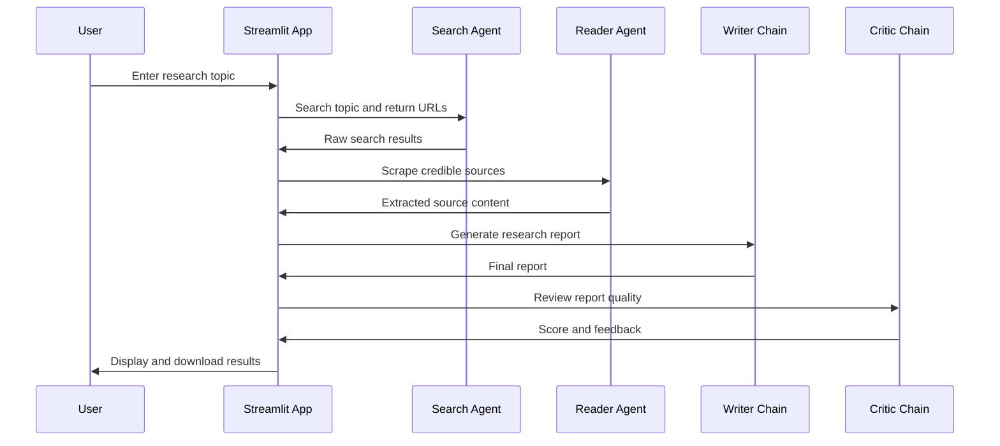

# Multi-Agent Research System Using LangChain

A modular AI research assistant that uses agent-based orchestration to search the web, read relevant sources, generate a structured research report, and critique the final output.

The project demonstrates a practical multi-agent workflow using **LangChain**, **Gemini**, **Tavily Search**, **web scraping tools**, and a **Streamlit UI**. It is designed as a lightweight research automation system where each component has a focused responsibility: searching, reading, writing, reviewing, and presenting results.

## What This Project Does

Given a research topic, the system runs a step-by-step research pipeline:

1. **Search Agent** finds relevant web results using Tavily.
2. **Reader Agent** selects credible URLs and scrapes source content.
3. **Writer Chain** creates a structured research report from gathered evidence.
4. **Critic Chain** reviews the report and provides a quality score, strengths, gaps, and a verdict.
5. **Streamlit App** displays each stage and allows the final research output to be downloaded as Markdown.

## Architecture

```mermaid
flowchart LR
    A[User Research Topic] --> B[Streamlit UI]
    B --> C[Research Pipeline]

    C --> D[Search Agent]
    D --> E[Tavily Search API]
    E --> F[Search Results with URLs]

    F --> G[Reader Agent]
    G --> H[Scraping Tools]
    H --> I[Requests / BeautifulSoup / Readability / Trafilatura]
    I --> J[Clean Source Content]

    J --> K[Writer Chain]
    F --> K
    K --> L[Structured Research Report]

    L --> M[Critic Chain]
    M --> N[Score, Strengths, Improvements, Verdict]

    L --> O[Downloadable Markdown Report]
    N --> O
```



## Agent Workflow



## Key Features

- Multi-step research pipeline with separated agent responsibilities
- Search integration through Tavily
- URL scraping with multiple extraction strategies
- LangChain-based prompt chains for writing and critique
- Streamlit interface with progress tracking and expandable execution steps
- Markdown export for the final research report
- Modular structure for adding new agents, tools, or pipeline stages

## Tech Stack

| Area | Tools |
| --- | --- |
| Language | Python |
| Agent Orchestration | LangChain |
| LLM Provider | Google Gemini via `langchain_google_genai` |
| Search | Tavily Search API |
| Web Scraping | Requests, BeautifulSoup, Readability, Trafilatura, lxml |
| UI | Streamlit |
| Config | python-dotenv |

## Project Structure

```text
.
├── app.py                    # Streamlit UI and interactive research workflow
├── main.py                   # Minimal command-line runner
├── requirements.txt          # Python dependencies
└── src/
    ├── Agents/
    │   └── agents.py         # Search agent, reader agent, writer chain, critic chain
    ├── Pipelines/
    │   └── pipeline.py       # CLI research pipeline orchestration
    └── Tools/
        └── tools.py          # Tavily search and URL scraping tools
```

## How It Works

### 1. Search

The search agent uses the Tavily API to retrieve relevant results for the input topic. It returns raw titles, URLs, and snippets so downstream agents can choose useful sources.

### 2. Read and Scrape

The reader agent uses scraping tools to extract readable text from selected URLs. The scraper uses multiple strategies, including Trafilatura, Readability, and BeautifulSoup fallback extraction.

### 3. Write

The writer chain combines search results and scraped content into a structured report with an introduction, key findings, conclusion, and source list.

### 4. Critique

The critic chain reviews the generated report and returns a score, strengths, areas to improve, and a one-line verdict.

### 5. Export

The Streamlit app displays each stage and allows the full research output to be downloaded as a Markdown file.

## Setup

### 1. Clone the Repository

```bash
git clone https://github.com/jairammaddala/Multi_agent_system_for_research_using_langchain.git
cd Multi_agent_system_for_research_using_langchain
```

### 2. Create a Virtual Environment

```bash
python -m venv .venv
```

Windows:

```bash
.venv\Scripts\activate
```

macOS / Linux:

```bash
source .venv/bin/activate
```

### 3. Install Dependencies

```bash
pip install -r requirements.txt
```

### 4. Configure Environment Variables

Create a `.env` file in the project root.

```env
GOOGLE_API_KEY=your_google_gemini_api_key
Tavily_API_Key=your_tavily_api_key
```

> Note: The current code uses `ChatGoogleGenerativeAI` with Gemini and reads the Tavily key using `Tavily_API_Key`.

## Running the Project

### Streamlit App

```bash
streamlit run app.py
```

Then enter a research topic in the sidebar and click **Run Research**.

### Command-Line Runner

```bash
python main.py
```

The CLI runner currently uses a sample topic defined in `main.py`.

## Example Pipeline Output

The app produces a downloadable Markdown report containing:

- Research topic
- Search results
- Scraped source content
- Final research report
- Critic feedback

## Notes and Improvement Opportunities

- Add `.env.example` to document required environment variables.
- Update `requirements.txt` to include `langchain-google-genai` if it is not already installed in the environment.
- Split the likely typo `rich>=13.7.0lxml_html_clean` into separate dependency entries.
- Add tests for scraping fallback behavior and pipeline state transitions.
- Add configurable model/provider selection for Gemini, OpenAI, or other LangChain-compatible providers.

## Use Cases

- Automated research summarization
- Source discovery and content extraction
- Drafting structured reports from web evidence
- Evaluating AI-generated research quality
- Experimenting with multi-agent orchestration patterns

## License

This project is provided under the terms of the MIT License. See the `LICENSE` file if included in the repository.
